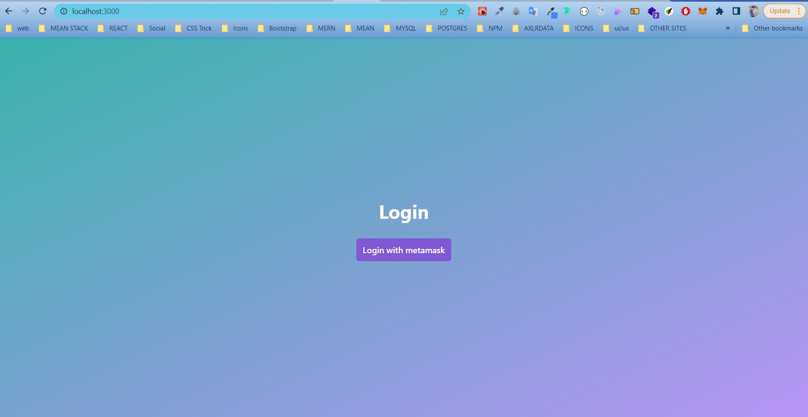
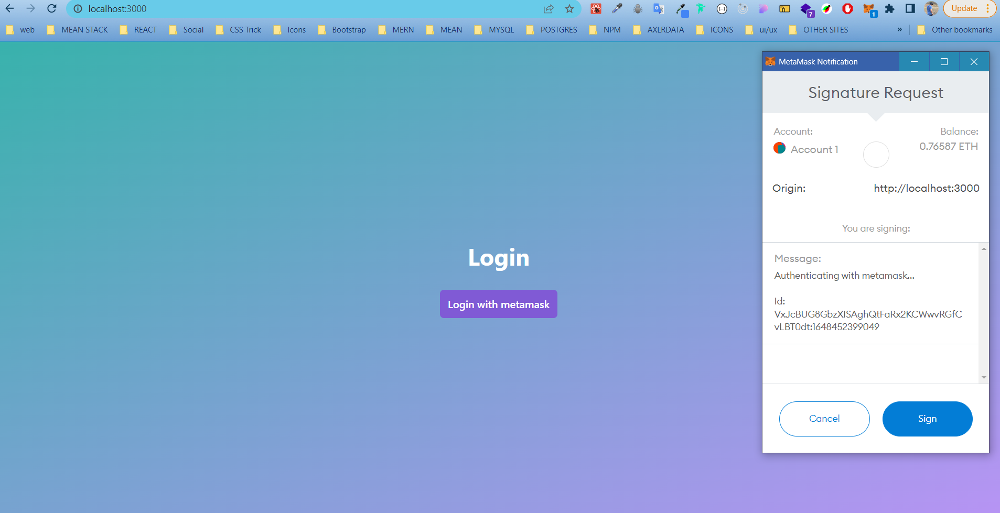
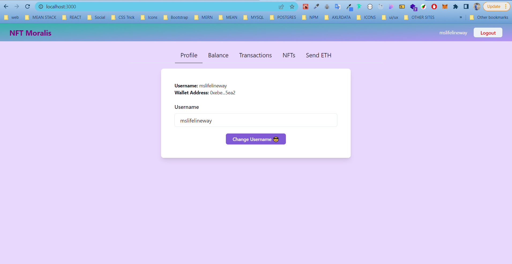
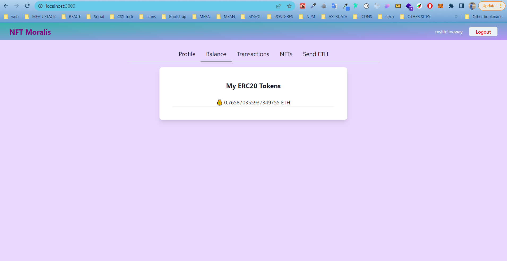
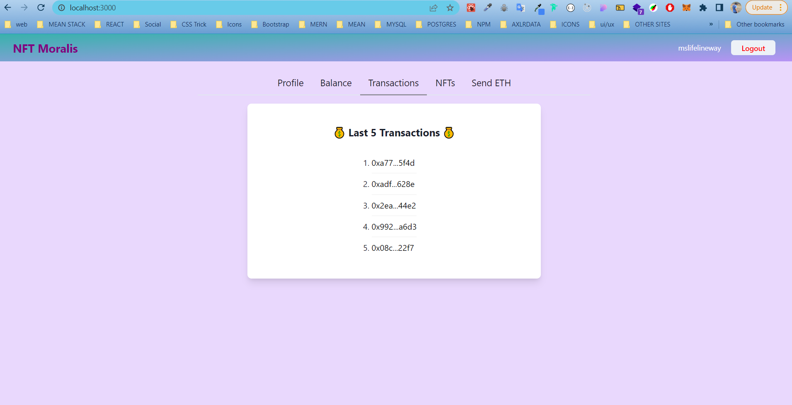
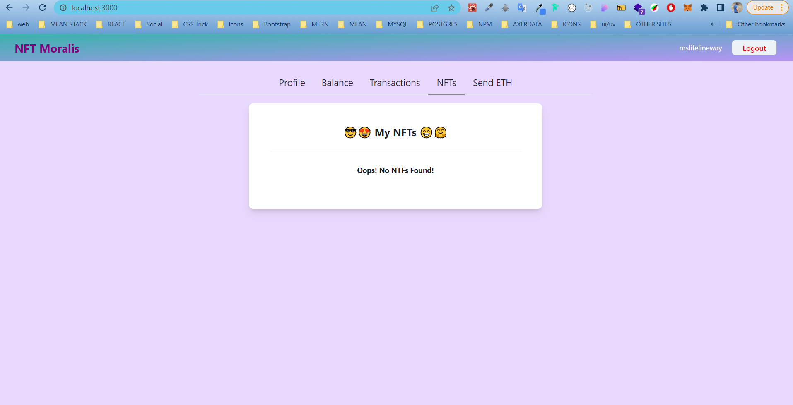
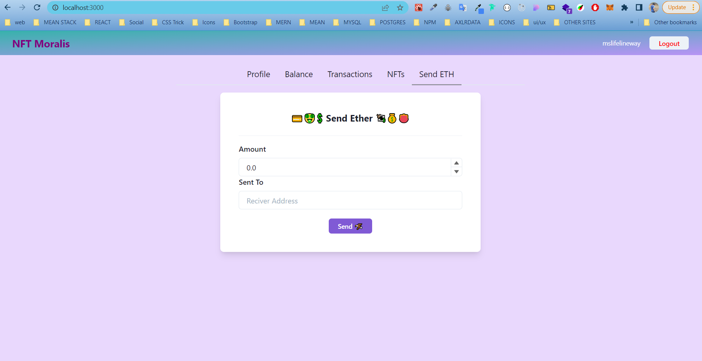

# Project - NFT Moralis

# Contact Details

    ✋Welcome to my profile
    📛 Mukesh Kumar 😍
     👨‍🏫 MERN full stack developer (1.5 yrs) | Blockchain Developer (fresher) | Web 3.0 Developer 💻👩‍💻
    📧 mukeshms40003@gmail.com
    📞 7015720216
    🤷‍♂️ Available for freelance (daily work time 2-4 hrs)

Visit 👉 https://dev-mukesh.netlify.com
Resource - theItalianDev (Youtube channel)

# Services (We provide)

    1. Freelancer (Hire me)
    2. Any kind of web development (using modern technology like React)
    3. Backend and Frontend (specialist)
    4. Writing smart contract (new in blockchain)

---

# Technologies

    - Next Js
    - React Js
    - Chakra-UI
    - Moralis
    - Localstorage
    - Web 3.0

# Web 3.0

. Web 3.0 is the next iteration of the internet that focuses on decentralisation. It aims to create a level of transparency, where smart contracts will control user data and transactions instead of centralised organisations
. Web 3.0 is the next iteration of the internet that focuses on decentralisation

# Functionalities

    1. Sending ethereum to others (other addresses)
    2. Viewing the transactions done by the user address
    3. Able to connect to metamask account.
    4. User can see the list of his NFTs.
    5. Moralis has been used to achieve all these services.

---

# SETUP PROCESS (Follow these instructions to setup this project on your local)

    clone this repository and follow the next js project guidelines.
    - start :  npm start

---

---

# SCREENSHOTS

# Login Page

# Login With Metamask

# Profile

# Balance

# Latest Transactions

# NFT

# Send Ether

