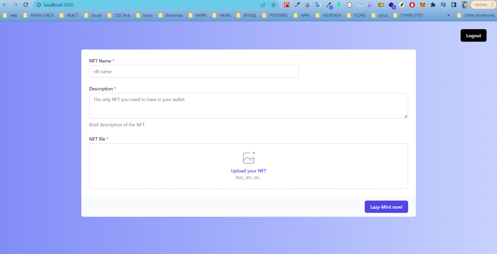

# Project - NFT Minter (Next Js project)

# Technologies

    - Next Js
    - React Js
    - Tailwind css
    - Moralis
    - IPFS
    - Localstorage
    - Web 3.0

# Contact Details

    ✋Welcome to my profile
    📛 Mukesh Kumar 😍
     👨‍🏫 MERN full stack developer (over 1.5 yrs) | Blockchain Developer (fresher) | Web 3.0 Developer 💻👩‍💻
    📧 mukeshms40003@gmail.com
    📞 7015720216
    🤷‍♂️ Available for freelance (daily work time 2-4 hrs)

Visit 👉 https://dev-mukesh.netlify.com
Resource - theItalianDev (Youtube channel)

# Web 3.0

. Web 3.0 is the next iteration of the internet that focuses on decentralisation. It aims to create a level of transparency, where smart contracts will control user data and transactions instead of centralised organisations
. Web 3.0 is the next iteration of the internet that focuses on decentralisation

# Functionalities

    1. Authentication using moralis
    2. Uploading nft files on rinkeby.rarible which is similar to opensea

# SETUP PROCESS (Follow these instructions to setup this project on your local)

    clone this repository and follow the next js project guidelines.
    - start :  npm run dev

# SCREENSHOTS

# Authentication Page

# Upload nft page

